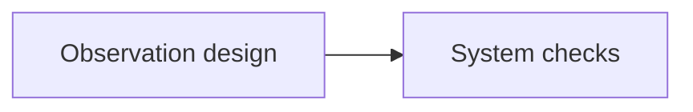

# Press PDF Export

High-fidelity PDF export plugin for Obsidian, powered by [Pandoc](https://pandoc.org/).

Press PDF Export converts Obsidian Markdown into Pandoc-compatible Markdown, then exports notes to PDF, Word, or HTML. It is desktop-only because it calls local command-line tools such as Pandoc, LaTeX, wkhtmltopdf, WeasyPrint, Typst, and Mermaid CLI.

## Status

- Version: `1.5.0`
- License: MIT
- Obsidian: desktop app only
- Minimum Obsidian version: `1.8.7`

## Features

- **Multiple PDF engines** — XeLaTeX, pdfLaTeX, LuaLaTeX, wkhtmltopdf, WeasyPrint, Typst
- **Export formats** — PDF, Word (DOCX), HTML
- **Batch export** — Export current folder or entire vault with concurrency control
- **Mermaid diagrams** — Pre-render Mermaid code blocks to SVG via `mmdc`
- **Custom styling** — Custom CSS (HTML engines) and Pandoc templates
- **CJK support** — Auto-detect Chinese/Japanese/Korean fonts for LaTeX engines
- **Heading typography** — Set a custom font for H1–H4; H2 uses a blue number tile and a light-blue rounded title bar (the tile stays blank when the H2 has no explicit number)
- **Designed cover page** — Creates a standalone technical-document cover with title, subtitle, author, institution, version, and date, followed by the table of contents
- **Code highlighting** — 6 built-in themes (Pygments, Tango, Zenburn, Breeze Dark, Kate, Monochrome)
- **Full content fidelity** — Images, math formulas, tables, callouts, wikilinks, embeds, highlights, superscript/subscript

## Prerequisites

### Required: Pandoc

Pandoc is the document converter used by every export format.

Download sources:

- Official site: <https://pandoc.org/installing.html>
- GitHub releases: <https://github.com/jgm/pandoc/releases>
- Homebrew formula: <https://formulae.brew.sh/formula/pandoc>

```bash
# macOS
brew install pandoc

# Ubuntu/Debian
sudo apt install pandoc

# Windows
winget install JohnMacFarlane.Pandoc
```

Verify:

```bash
which pandoc
pandoc --version
```

### PDF Engine (at least one)

The plugin supports these engines:

- **XeLaTeX** (`xelatex`) — recommended for high-quality PDF and CJK text
- **pdfLaTeX** (`pdflatex`) — classic LaTeX engine; CJK notes are exported with XeLaTeX automatically
- **LuaLaTeX** (`lualatex`) — LaTeX engine with good CJK support
- **wkhtmltopdf** (`wkhtmltopdf`) — HTML/CSS-based PDF output
- **WeasyPrint** (`weasyprint`) — HTML/CSS-based PDF output
- **Typst** (`typst`) — experimental Pandoc Typst backend

| Engine | Install | Quality | CJK Support |
|--------|---------|---------|-------------|
| **XeLaTeX** | `brew install --cask mactex-no-gui` or install BasicTeX/MacTeX | Best typesetting | Yes |
| **wkhtmltopdf** (lightweight) | `brew install wkhtmltopdf` | Good | Yes |
| **WeasyPrint** | `pip install weasyprint` | Good | Yes |
| **pdfLaTeX** | Included in BasicTeX/MacTeX/TeX Live | Good | No |
| **LuaLaTeX** | Included in BasicTeX/MacTeX/TeX Live | Good | Yes |
| **Typst** | `brew install typst` | Experimental | Yes |

### macOS: Install All Supported Engines

Install Homebrew first if needed: <https://brew.sh/>.

This installs Pandoc, Typst, wkhtmltopdf, WeasyPrint, SVG conversion support, and Mermaid CLI:

```bash
brew install pandoc typst wkhtmltopdf librsvg
pip install weasyprint
npm install -g @mermaid-js/mermaid-cli
```

Install LaTeX engines (`xelatex`, `pdflatex`, `lualatex`) with one of these:

```bash
# Full TeX Live distribution without GUI apps
brew install --cask mactex-no-gui

# Smaller distribution; enough for the CLI engines
brew install --cask basictex
```

Download sources:

- MacTeX: <https://www.tug.org/mactex/>
- BasicTeX packages: <https://www.tug.org/mactex/morepackages.html>
- CTAN MacTeX directory: <https://ctan.org/texarchive/systems/mac/mactex/>

If the Homebrew `mactex-no-gui` or `basictex` cask points to an expired CTAN package, download the current BasicTeX package directly and install it:

```bash
curl -L https://mirrors.ctan.org/systems/mac/mactex/mactex-basictex-20260301.pkg -o /tmp/mactex-basictex.pkg
sudo installer -pkg /tmp/mactex-basictex.pkg -target /
```

BasicTeX installs the TeX CLI tools into `/Library/TeX/texbin`. Press PDF Export adds this directory to its runtime PATH, but after installing BasicTeX/MacTeX you should restart Obsidian.

Verify all engines:

```bash
PATH=/Library/TeX/texbin:/opt/homebrew/bin:/usr/local/bin:$PATH which \
  pandoc xelatex pdflatex lualatex wkhtmltopdf weasyprint typst mmdc
```

Expected locations on Apple Silicon macOS after the installation used during development:

```text
/opt/homebrew/bin/pandoc
/Library/TeX/texbin/xelatex
/Library/TeX/texbin/pdflatex
/Library/TeX/texbin/lualatex
/usr/local/bin/wkhtmltopdf
/opt/homebrew/bin/weasyprint
/opt/homebrew/bin/typst
/opt/homebrew/bin/mmdc
/opt/homebrew/bin/rsvg-convert
```

### Optional: Mermaid CLI

Mermaid CLI renders Mermaid code blocks to SVG before Pandoc runs.

Download sources:

- npm package: <https://www.npmjs.com/package/@mermaid-js/mermaid-cli>
- GitHub repository: <https://github.com/mermaid-js/mermaid-cli>

```bash
npm install -g @mermaid-js/mermaid-cli
```

Verify:

```bash
which mmdc
mmdc --version
```

## Installation

### From Source

```bash
git clone <repo-url>
cd obsidian-press
npm install
npm run build
```

Then copy the built files to your vault:

```bash
mkdir -p /path/to/your-vault/.obsidian/plugins/press-pdf-export/
cp main.js manifest.json styles.css /path/to/your-vault/.obsidian/plugins/press-pdf-export/
```

In Obsidian: **Settings → Community Plugins → Enable "Press PDF Export"**.

### Pre-built

Copy `main.js`, `manifest.json`, `styles.css` into `<vault>/.obsidian/plugins/press-pdf-export/` and enable the plugin in Obsidian settings.

## Usage

### Commands

| Command | Description |
|---------|-------------|
| Export current note to PDF | Export the active Markdown file to PDF |
| Export current note to PDF... | Choose an output folder, then export the active Markdown file to PDF |
| Export current note to Word (DOCX) | Export to Word format |
| Export current note to Word (DOCX)... | Choose an output folder, then export to Word format |
| Export current note to HTML | Export to HTML |
| Export current note to HTML... | Choose an output folder, then export to HTML |
| Export all notes in current folder | Batch export the folder containing the active file |
| Export all notes in current folder... | Choose an output folder, then batch export the current folder |
| Export entire vault | Batch export all Markdown files in the vault |
| Export entire vault... | Choose an output folder, then batch export the whole vault |

Access via **Command Palette** (`Cmd/Ctrl + P`) or the ribbon icon (file output icon in the left sidebar).

### Right-Click Menu

- Right-click a `.md` file → **导出为 PDF（Press PDF Export）**
- Right-click a `.md` file → **选择目录导出为 PDF（Press PDF Export）**
- Right-click a folder → **全部导出为 PDF（Press PDF Export）**
- Right-click a folder → **选择目录全部导出为 PDF（Press PDF Export）**

## Settings

### General

| Setting | Default | Description |
|---------|---------|-------------|
| Pandoc path | `/opt/homebrew/bin/pandoc` | Path to the Pandoc executable. Required for every export format and every PDF engine |
| PDF engine | XeLaTeX | Engine used for PDF output. XeLaTeX is recommended for Chinese/Japanese/Korean notes and high-quality typesetting |
| Default format | PDF | Default export format |

### Output

| Setting | Default | Description |
|---------|---------|-------------|
| Output directory | `pdf` | Relative to vault root, or absolute path |
| File naming | Same as source | `same` / `timestamp` / `suffix` |
| Open after export | On | Auto-open exported file |

### Document

| Setting | Default | Description |
|---------|---------|-------------|
| Author | (empty) | Default author shown in the title block. Overridden per-note by frontmatter `author:` field |

### Typography

| Setting | Default | Description |
|---------|---------|-------------|
| Font size | 11pt | Base font size |
| PDF line spacing | `1.5` | Line spacing multiplier for LaTeX, Typst, wkhtmltopdf, and WeasyPrint PDF exports |
| PDF color scheme | Current color | PDF-only theme. Choose Formal grayscale for neutral headings, callouts, links, and code highlighting; inserted images retain their original colors |
| Page size | A4 | A4, Letter, Legal, A3 |
| Page margin | 25mm | Page margin |
| Code theme | Tango | Syntax highlight theme. Tango is the default because it gives PDF code blocks a visible background |
| Heading font | `STHeitiSC-Medium` | Font for H1–H4 headings in LaTeX PDF exports. Sizes scale proportionally with the base font size (1.80×, 1.55×, 1.33×, 1.00×); H2 is rendered as a blue number tile plus a light-blue title bar. Leave empty to use the body font. XeLaTeX and LuaLaTeX only |
| CJK font | (auto-detect) | Chinese/Japanese/Korean font. On macOS, XeLaTeX falls back to `STHeitiSC-Medium` when this is empty |
| Enable CJK support | On | CJK font config for LaTeX |
| DOCX body font | `STSong` | Font used by normal text in Word exports. The font must be installed on the computer opening the DOCX |
| DOCX heading font | `Hiragino Sans GB` | Font used by titles and heading levels in Word exports |
| DOCX line spacing | `1.5` | Line spacing multiplier written into the default Word paragraph style |

PDF and DOCX exports choose the table-of-contents title from the main prose:
Chinese-led documents use `目录`, while English-led documents use `Contents`.
Frontmatter, code blocks, equations, comments, and link targets are excluded
from this language decision. DOCX body content starts on a new page after the
table of contents.

### Advanced

| Setting | Default | Description |
|---------|---------|-------------|
| Custom CSS file | (empty) | Path to custom CSS (HTML engines only) |
| Custom Pandoc template | (empty) | Path to custom Pandoc template |
| Mermaid CLI path | `mmdc` | Path to mermaid-cli binary |
| Mermaid theme | Default | Mermaid diagram theme |
| Extra Pandoc arguments | (empty) | Additional CLI args for Pandoc |

### Batch Export

| Setting | Default | Description |
|---------|---------|-------------|
| Concurrency | 3 | Parallel export count |
| Skip errors | On | Continue on failure |

## Cover Page

LaTeX PDF exports open with a clean technical-document cover: document tags in
the blue vertical spine, category and institution above the title, a keyword in
the central network motif, and a compact metadata block at the bottom. The table
of contents starts on page two.

Field resolution:

| Field | Source | Fallback |
|---|---|---|
| Title | Frontmatter `title:` | Humanized filename (`my-note` → `My Note`) |
| Subtitle | Frontmatter `subtitle:` | Not shown |
| Category | Frontmatter `category:` | `Note` |
| Tags | Frontmatter `tags:` | `未分类` |
| Keyword | Frontmatter `keyword:` | `Report` |
| Author | Frontmatter `author:` | Plugin setting **Author** |
| Institution | Frontmatter `institution:` | `中国科学院上海天文台` |
| Version | Frontmatter `version:` | Omitted if not present |
| Updated | Frontmatter `modified:` (date portion only) | File last-modified date |
| Date metadata | Frontmatter `date:` | File last-modified date |

Hierarchical Obsidian tags are shortened to their final segment on the cover.
For example, `research/global-21cm` is displayed as `global-21cm`.
Both inline lists (`tags: [one, two]`) and Obsidian's unindented YAML lists are
supported:

```yaml
tags:
- research/global-21cm
- research/EoR
- foreground-separation
```

Example frontmatter:

```yaml
---
title: K Array CMB Sensitivity Estimation
subtitle: Technical Reference and Analysis Report
category: 研究笔记
tags: [research/CMB, analysis/sensitivity, simulation]
keyword: CMB
author: Quan Guo
institution: Shanghai Astronomical Observatory
version: "1.2"
date: 2026-08-04
modified: 2026-08-05
---
```

Dollar-delimited LaTeX math is supported in cover fields, for example
`title: Global $T_{\rm EoR}$ Recovery Report`.

## Content Fidelity

Obsidian-specific syntax is pre-processed before passing to Pandoc:

PDF export is powered by Pandoc engines. XeLaTeX is the recommended default for mixed Chinese/English notes, while Typst, wkhtmltopdf, and WeasyPrint are available for users who prefer those toolchains.

| Obsidian Syntax | Output |
|----------------|--------|
| `> [!note] Title` callouts | Type-specific boxes for note, summary, tip, important, warning, caution, abstract, info, todo, example, quote, success, question, failure, danger, and bug |
| `[[wikilink]]` | Standard Markdown links |
| `![[image.png]]` embeds | Absolute path image references |
| `` | Local image paths resolved from the note or attachment directory |
| `![[other-note]]` embeds | Inlined note content (up to 5 levels deep) |
| `==highlighted text==` | `<mark>` HTML tags |
| `^superscript^` | Native superscript via Pandoc `+superscript` extension (renders correctly in LaTeX PDF) |
| `~subscript~` | Native subscript via Pandoc `+subscript` extension |
| `~~strikethrough~~` | Native strikethrough via Pandoc `+strikeout` extension |
| `%%comment%%` | Removed from output |
| ` ```mermaid ``` ` | Pre-rendered SVG images |
| `%% caption: Diagram title` inside a Mermaid block | Custom figure caption |
| ` ```ts ... ``` ` code blocks | Preserved for Pandoc syntax highlighting |
| Inline code spans | Preserved without Obsidian syntax conversion |
| LaTeX math (`$...$`, `$$...$$`) | Native Pandoc math rendering |
| Pipe/grid tables | Native Pandoc table support |
| Images with `\|size` | Resized image tags |

Legacy TeX font switches inside math, such as `{\rm row}` and
`{\bf x}`, are normalized to `\mathrm{row}` and `\mathbf{x}` so
DOCX exports remain editable Word equations instead of falling back to literal
TeX source.

### Image sizing and captions

Images without an explicit width are exported at 95% of the available page
width. Oversized numeric Obsidian widths are capped at that limit using the
configured paper size and margins. Smaller numeric widths and explicit
percentage/physical-unit Pandoc widths take precedence:

```markdown
![[image.png|420]]
{width=95%}
```

For LaTeX PDF output, images at 70% width or larger reserve vertical space based
on the source image's real aspect ratio plus a caption allowance. If the image
fits it remains on the current page; otherwise it moves intact to the next page.

Mermaid diagrams keep Mermaid's original sizing and are excluded from this
image-width rule.

An image is numbered only when it is immediately followed by an italic Chinese
or English figure line. Images without one are exported with an empty alt and
remain unnumbered. The source prefix is removed because Pandoc supplies the
number automatically, and the standalone line is removed to avoid duplication:

```markdown


*图 1：Observation and data processing workflow*
```

LaTeX math in a caption is parsed by Pandoc. Both dollar and backslash math
delimiters are supported, and LaTeX commands are preserved:

```markdown


*图 1：恢复信号 $T_{\rm EoR}$ 与区间 $x \in [0,1]$*
```

Chinese markers select a `图 1` caption prefix; English markers select a
`Figure 1` prefix:

```markdown


*Figure 1: Observation and data processing workflow*
```

### Mermaid captions

Add a `%% caption:` comment inside a Mermaid block to set the exported
figure caption:

````markdown

````

If the directive is omitted, the caption defaults to `Mermaid Diagram N`.
Use an empty directive (`%% caption:`) to export the diagram without a
caption. Caption metadata is removed before Mermaid renders the diagram.

Mermaid flowchart labels are rendered as native SVG text instead of HTML
`foreignObject` elements, so labels—including CJK text—remain visible when
Pandoc's PDF pipeline converts the SVG.

## Project Structure

```
obsidian-press/
├── src/
│   ├── main.ts          # Plugin entry: commands, menus, lifecycle
│   ├── settings.ts      # Settings tab UI
│   ├── types.ts         # TypeScript interfaces and types
│   ├── pandoc.ts        # Pandoc CLI wrapper (spawn with array args)
│   ├── renderer.ts      # Obsidian MD → standard MD preprocessing
│   ├── mermaid.ts       # Mermaid → SVG pre-rendering
│   ├── exporter.ts      # Export orchestration (single/batch/vault)
│   └── utils.ts         # Path resolution, font detection, helpers
├── styles/
│   └── default.css      # Built-in PDF styles (callouts, code, tables)
├── templates/
│   └── default.html     # HTML template for wkhtmltopdf
├── manifest.json
├── package.json
├── esbuild.config.mjs
└── styles.css           # Plugin UI styles (in Obsidian)
```

## Development

```bash
npm install
npm run dev      # Watch mode with esbuild
npm run typecheck
npm run build    # Production build → main.js
```

`npm run build` runs TypeScript type checking before bundling.

### Release Checklist

1. Update `version` in `package.json` and `manifest.json`.
2. Update `versions.json` for Obsidian plugin compatibility.
3. Update `CHANGELOG.md`.
4. Run:

```bash
npm install
npm run typecheck
npm run build
npm run verify:code-export
```

5. Verify the release files exist:

```bash
ls -lh main.js manifest.json styles.css
```

6. Package or attach these files for a manual release:

```text
main.js
manifest.json
styles.css
```

Or generate the release asset directory automatically:

```bash
npm run release:package
```

The package is written to `dist/press-pdf-export-<version>/`.

### Obsidian Community Plugin Submission

The marketplace plugin id is `press-pdf-export`; the display name remains **Press PDF Export**.

To submit to the Obsidian community plugin directory:

1. Push this repository to GitHub.
2. Create a GitHub release whose tag exactly matches `manifest.json`, for example `1.0.0`.
3. Attach `main.js`, `manifest.json`, and `styles.css` from `dist/press-pdf-export-<version>/`.
4. Fork `obsidianmd/obsidian-releases`.
5. Add the plugin entry from `MARKETPLACE.md` to `community-plugins.json`.
6. Open a pull request titled `Add plugin: Press PDF Export`.

### Engine Verification

The project has been verified with all supported PDF engines on macOS:

```text
xelatex
pdflatex
lualatex
wkhtmltopdf
weasyprint
typst
```

You can run a quick local Pandoc check with:

```bash
mkdir -p /tmp/obsidian-press-engine-test
cat > /tmp/obsidian-press-engine-test/input.md <<'EOF'
# Press PDF Export Engine Test

This is a PDF export test.

- Math: $E = mc^2$

| A | B |
|---|---|
| 1 | 2 |
EOF

for engine in xelatex pdflatex lualatex wkhtmltopdf weasyprint typst; do
  PATH=/Library/TeX/texbin:/opt/homebrew/bin:/usr/local/bin:$PATH \
  LANG=en_US.UTF-8 \
  LC_ALL=en_US.UTF-8 \
  TEXMFVAR=/tmp/obsidian-press-engine-test/tex-cache \
  TEXMFCACHE=/tmp/obsidian-press-engine-test/tex-cache \
  pandoc /tmp/obsidian-press-engine-test/input.md \
    -o /tmp/obsidian-press-engine-test/$engine.pdf \
    --from markdown+pipe_tables+tex_math_dollars \
    --standalone \
    --pdf-engine=$engine
done
```

## Troubleshooting

### "pandoc not found"

Set the full path to pandoc in plugin settings (e.g., `/opt/homebrew/bin/pandoc` or `/usr/local/bin/pandoc`).

Find your pandoc path:
```bash
which pandoc
```

### "PDF engine not installed"

Install a PDF engine from the prerequisites list. wkhtmltopdf is the lightest option:
```bash
brew install wkhtmltopdf
```

For LaTeX engines on macOS, BasicTeX installs binaries under `/Library/TeX/texbin`:

```bash
PATH=/Library/TeX/texbin:$PATH which xelatex pdflatex lualatex
```

Restart Obsidian after installing BasicTeX or MacTeX.

### "openTempFile: permission denied" or read-only file system errors

Pandoc or a PDF engine is trying to create temporary files in a non-writable directory. Press PDF Export sets `TMPDIR`, `TMP`, `TEMP`, `TEXMFVAR`, and `TEXMFCACHE` to the plugin's temporary directory at runtime. If this still appears:

1. Restart Obsidian after updating the plugin.
2. Make sure the vault is writable.
3. Avoid placing the vault in a read-only synced or mounted location.

### LuaLaTeX reports missing `lualatex-math.sty`

BasicTeX is intentionally small and may not include every LuaLaTeX package. Install the missing package in user mode:

```bash
LANG=en_US.UTF-8 LC_ALL=en_US.UTF-8 /Library/TeX/texbin/tlmgr init-usertree
LANG=en_US.UTF-8 LC_ALL=en_US.UTF-8 /Library/TeX/texbin/tlmgr --usermode \
  --repository https://mirrors.tuna.tsinghua.edu.cn/CTAN/systems/texlive/tlnet \
  install lualatex-math
```

### PDF code blocks have no visible background

Pandoc highlight themes without a background can make code blocks look too close to normal paragraphs. Press PDF Export uses Tango by default because it includes a visible code block background.

For LaTeX PDF engines, Press PDF Export uses Pandoc's `--listings` mode and injects a small `\lstset{...}` header so long code lines wrap within the page instead of overflowing horizontally.

If you disable listings manually through custom Pandoc arguments and rely on Pandoc's default LaTeX highlighter, a highlighted background may require `framed.sty`. BasicTeX may not include it:

```bash
LANG=en_US.UTF-8 LC_ALL=en_US.UTF-8 /Library/TeX/texbin/tlmgr --usermode \
  --repository https://mirrors.aliyun.com/CTAN/systems/texlive/tlnet \
  install framed
```

You can verify code block export locally:

```bash
npm run verify:code-export
```

### XeLaTeX reports missing `svg.sty`

This happens when a note contains SVG images or Mermaid diagrams rendered to SVG, and BasicTeX does not include the LaTeX SVG package. Install the missing TeX packages into the user TeX tree:

```bash
mkdir -p /tmp/texlive-svg-packages
cd /tmp/texlive-svg-packages
for pkg in svg transparent trimspaces catchfile import; do
  curl -L https://mirrors.aliyun.com/CTAN/systems/texlive/tlnet/archive/$pkg.tar.xz -o $pkg.tar.xz
  tar -xJf $pkg.tar.xz -C ~/Library/texmf
done
PATH=/Library/TeX/texbin:$PATH mktexlsr ~/Library/texmf
```

Pandoc also needs `rsvg-convert` to convert SVG files before LaTeX consumes them:

```bash
brew install librsvg
which rsvg-convert
```

### XeLaTeX reports `Cannot determine size of graphic` for `.webp`

LaTeX engines cannot reliably include WebP images directly. Press PDF Export converts local WebP images to temporary PNG files before running LaTeX. This requires `dwebp`, which is provided by WebP tools:

```bash
brew install webp
which dwebp
```

The temporary PNG files are written under the plugin temp directory and cleaned up after export.

### Typst reports `file not found` for `https:/...` images

Pandoc's Typst backend may treat remote image URLs with query strings as local file paths. Press PDF Export downloads remote images to the plugin temp directory before Typst runs, strips WeChat's `tp=webp` image parameter when possible, and converts downloaded WebP images to PNG.

If a remote image cannot be downloaded, the export continues with a small placeholder image instead of failing the whole document.

### Mermaid diagrams not rendering

Install the Mermaid CLI:
```bash
npm install -g @mermaid-js/mermaid-cli
```

### CJK characters not showing

1. Enable "Enable CJK support" in settings
2. Set a CJK font name. On macOS with BasicTeX, `STHeitiSC-Medium` is a reliable choice; `PingFang SC` may be unavailable to XeTeX because it is a system-reserved font.
3. Use XeLaTeX or LuaLaTeX as the PDF engine

pdfLaTeX cannot process Chinese/Japanese/Korean Unicode text directly. If `pdfLaTeX` is selected for a CJK note, Press PDF Export automatically uses XeLaTeX for that export.

If XeLaTeX reports `File 'xeCJK.sty' not found`, install the missing package:

```bash
LANG=en_US.UTF-8 LC_ALL=en_US.UTF-8 /Library/TeX/texbin/tlmgr --usermode \
  --repository https://mirrors.aliyun.com/CTAN/systems/texlive/tlnet \
  install xecjk
```

### Export takes too long

- Reduce concurrency in batch settings
- Large files with many images or Mermaid diagrams take longer
- wkhtmltopdf is faster than XeLaTeX for simple documents

## Contributing

See [CONTRIBUTING.md](CONTRIBUTING.md) for development setup, local testing, dependency checks, and pull request guidelines.

## Changelog

See [CHANGELOG.md](CHANGELOG.md).

## License

MIT. See [LICENSE](LICENSE).
